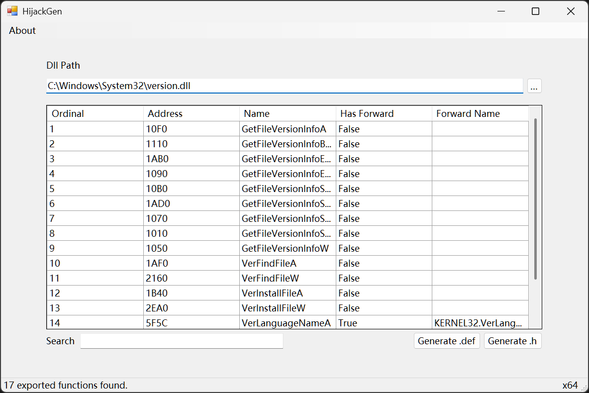

# HijackGen

A simple tool to generate dll source code for dll hijacking.



## Features

* Support x86 and x64 PE files.
* Support generating x86 and x64 dll source code.
* Support dll proxying.
* Support invalid characters detection in function names.
* Support custom invalid characters by editing `InvalidChars.txt`.

## Download

You can download the latest release from the [Releases](https://github.com/detached64/HijackGen/releases/latest) page.

If you do not have the .NET 9 runtime installed, you can download it from the [.NET download page](https://dotnet.microsoft.com/download/dotnet/9.0) or just download the self-contained version.

## Usage

[English](./docs/Usage.md) | [中文](./docs/Usage_zh-CN.md)

## Build

```bash
dotnet publish -c Release -r win-x64 -p:PublishSingleFile=true --self-contained false
```

## Reference

* [PeNet](https://github.com/secana/PeNet)

* [dll-hijack-by-proxying](https://github.com/tothi/dll-hijack-by-proxying)

* [AheadLib-x86-x64](https://github.com/strivexjun/AheadLib-x86-x64)
