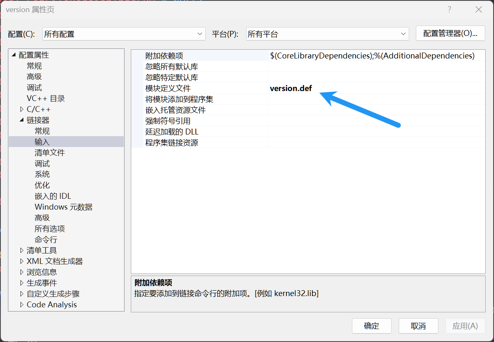

# 如何利用 h 文件实现 dll 劫持

## 环境

* Visual Studio 2022

## 劫持 32 位 dll

1. 新建一个空 dll 项目，例如 `version`。
2. 下载本项目，选择要劫持的 dll，例如 `C:\Windows\SysWOW64\version.dll`。
3. 点击 `生成 h 文件` 按钮，选择 `x86`，生成 h 文件到项目目录下。
4. 在 `dllmain.cpp` 中添加 `#include "version.h"`。
5. 调用 `InitHijack` 和 `FreeHijack` 函数实现劫持。
6. 编译项目，生成 dll 文件，复制到目标目录下。

## 劫持 64 位 dll

1. 新建一个空 dll 项目，例如 `version`。
2. 下载本项目，选择要劫持的 dll，例如 `C:\Windows\System32\version.dll`。
3. 点击 `生成 h 文件` 按钮，选择 `x64`，并勾选 `同时生成def文件`，生成 h 文件和 def 文件到项目目录下。
4. 在 `dllmain.cpp` 中添加 `#include "version.h"`。
5. 右键项目，选择 `属性`，`配置属性`，`链接器`，`输入`，`模块定义文件`，添加 `version.def`。
   
6. 调用 `InitHijack` 和 `FreeHijack` 函数实现劫持。
7. 编译项目，生成 dll 文件，复制到目标目录下。