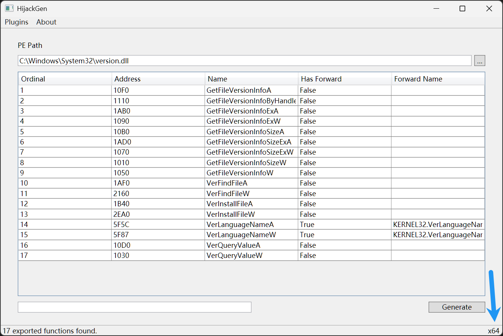

# 用法

* [利用 def 文件实现 dll 劫持](Def_zh-CN.md)
* [利用 h 文件实现 dll 劫持](H_zh-CN.md)

## 知识

* 32 位系统 dll 在 `C:\Windows\SysWOW64` 目录下，64 位系统 dll 在 `C:\Windows\System32` 目录下。
* 当 32 位程序访问 `C:\Windows\System32` 目录时，系统会自动重定向到 `C:\Windows\SysWOW64` 目录；64 位程序无类似重定向。
* 程序右下角会显示当前 dll 的位数。
  