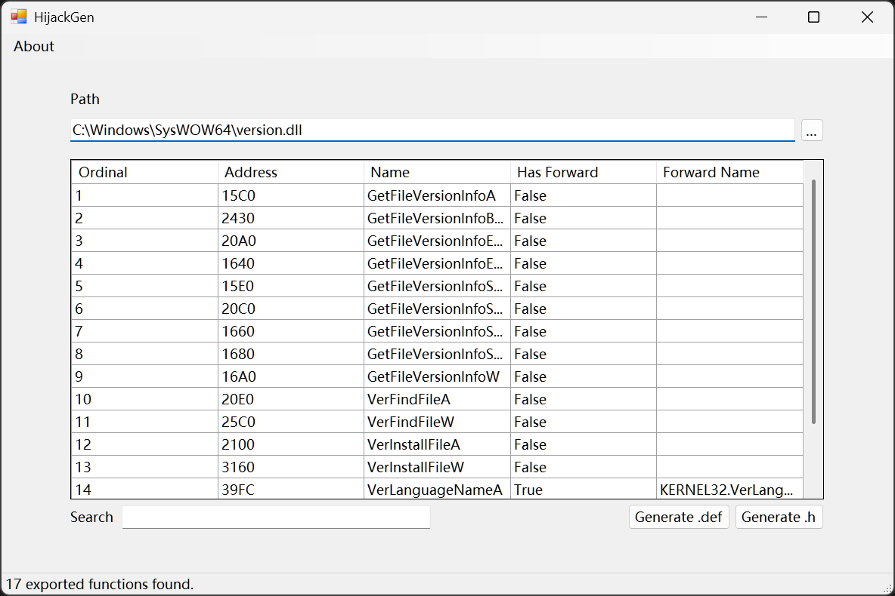

# HijackGen

A simple tool to generate dll source code for dll hijacking.

**Under development, not stable**

## Usage

Select or drag and drop the target dll file to the tool, then click the `Generate .def` button to generate the .def file or click the `Generate .h` button for .h file.

## Reference

* [dll-hijack-by-proxying](https://github.com/tothi/dll-hijack-by-proxying)

* [AheadLib-x86-x64](https://github.com/strivexjun/AheadLib-x86-x64)